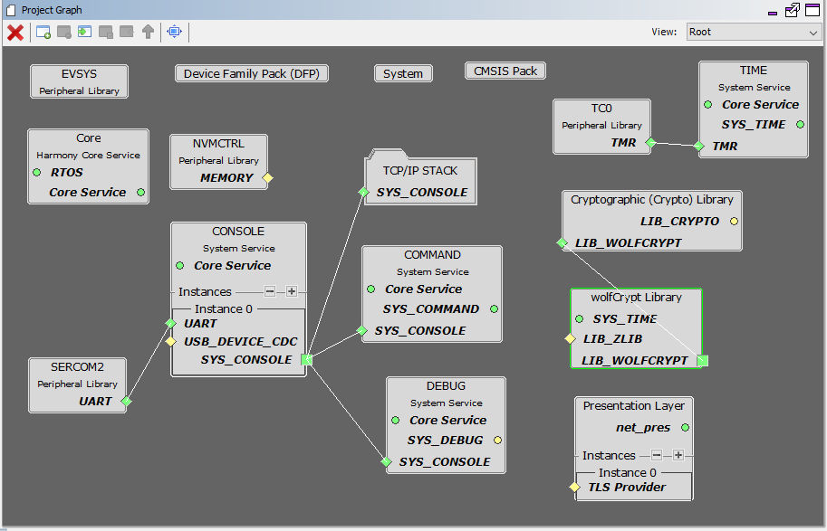
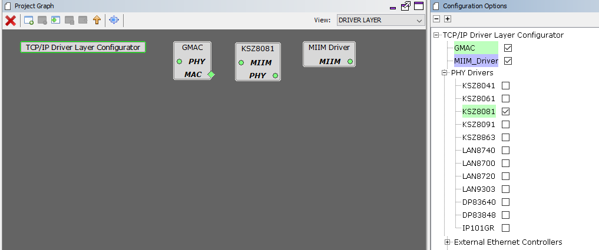

# TCP/IP TCP and UDP Client Server MHC Configuration

The following Project Graph diagram shows the Harmony components included in the TCP Client demonstration application.

* MHC is launched by selecting **Tools > Embedded > MPLAB® Harmony 3 Configurator** from the MPLAB X IDE and after successful database migration , TCP/IP demo project is ready to be configured and regenerated.

    

* **TCP/IP Root Layer Project Graph**

  The root layer project shows that USART1 peripheral is selected to do read and write operation for TCP/IP commands.

  This is the basic configuration with SYS_CONSOLE, SYS_DEBUG and SYS_COMMAND modules. These modules are required for TCP/IP command execution.

  

  **FreeRTOS** component is required for RTOS application. For bare-metal (non-RTOS) **FreeRTOS** component should not be selected.

  **NOTE** - The above diagram contains **FreeRTOS** component  and that is required for RTOS application. For bare-metal(non-RTOS) **FreeRTOS** component shouldn't be selected.
  
  
  
  TCP sockets calculate the ISN using the wolfSSL crypto library. 

* **TCP/IP Required Application**

  TCP/IP demo use these application module components for this demo. **Announce** module to discover the Microchip devices within a local network.
  
  **DHCP Client** module to discover the IPv4 address from the nearest DHCP Server.
  
  **DNS Client** provides DNS resolution capabilities to the stack. 
  
  **Berkeley API**  module provides the Berkeley_Socket_Distribution (BSD) wrapper to the native Microchip TCP/IP Stack APIs. During this component selection, the required transport and network modules are also selected.

    

* **TCPIP Driver Layer**

  **Internal ethernet driver(gmac)** is enabled with the external **KSZ8081 PHY driver** library for SAMA5D2 demonstartion. 

    

  
  The MIIM Driver supports asynchronous read/write and scan operations for accessing the external PHY registers and notification when MIIM operations have completed.

