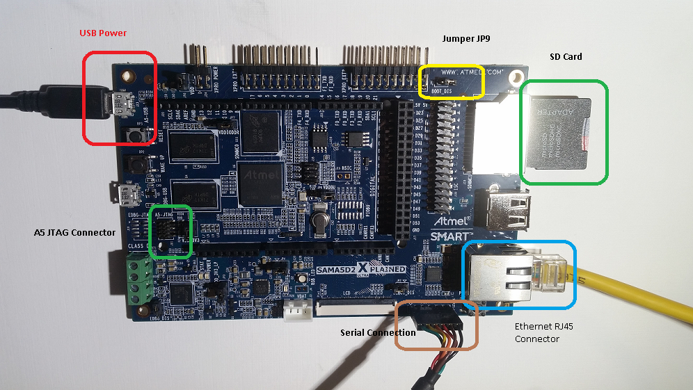

# TCP/IP UDP Client Hardware Configuration

This section describes the hardware configuration for ATSAM A5D2 Xplained Ultra Evaluation Kit and one can be used for the respective application demonstration.

1. This section describes the required default hardware configuration use SAM A5D2 Xplained Ultra Evaluation Kit
  
      [SAM A5D2 Xplained Ultra Evaluation Kit](http://ww1.microchip.com/downloads/en/devicedoc/Atmel-44028-32-bit-Cortex-A5-Microprocessor-SAMA5D2-Xplained-Ultra_User-Guide.pdf)

      

      * Ensure JP9 jumper is Open. 
      * Insert the SD Card with the "harmony.bin" output of the project into the SD card slot, J19 
      * Connect the board to a USB port on the test PC by inserting the serial cable into the serial connector, J1 
      * For debugging insert the Atmel SAM-ICE debugger to the JTAG port, J11 
      * Connect the micro USB cable from the computer to the USB Power connector on the SAM A5D2 Xplained Ultra Evaluation Kit to power the board, J23 
      * Establish a connection between the router/switch with the SAM A5D2 Xplained Ultra Evaluation Kit through the RJ45 connector 
